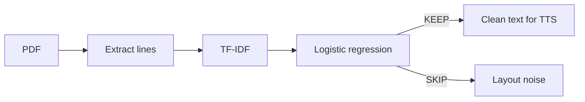

# CleanListen

> **Turn noisy research PDFs into cleaner text for screen readers and text-to-speech — without summarizing away the paper.**

[](https://github.com/jumiknows/CleanListen/actions/workflows/ci.yml)

CleanListen is a small Python tool that classifies extracted PDF lines as **KEEP** or **SKIP**. It preserves research content while removing layout noise such as page numbers, publisher boilerplate, URLs, and other material that makes long papers painful to listen to.

**Original prototype results:** **91.2% accuracy · 89.7% KEEP F1 · 94.0% noise specificity**. The notebook also estimated roughly **48–52% less listening text** on its evaluated examples. These are prototype results from the original experiment, not universal performance claims.

## What changes

A PDF-to-speech pipeline can sound like this:

```text
Journal of Example Research
Page 12
Methods
Participants completed three listening tasks.
https://doi.org/10.0000/example
Copyright Example Publisher
Results
The cleaned version reduced non-content lines.
```

CleanListen aims to produce:

```text
Methods
Participants completed three listening tasks.
Results
The cleaned version reduced non-content lines.
```

It **filters** the document. It does not summarize or rewrite the research.

## Quick start

```bash
# from the repository
python -m pip install -e ".[dev]"

# train from the existing labeled dataset
cleanlisten train data/labeled_lines.csv \
  --model artifacts/cleanlisten.joblib

# clean a paper
cleanlisten clean data/paper1.pdf \
  --model artifacts/cleanlisten.joblib \
  --output outputs/paper1.txt \
  --stats-json reports/paper1.json

# reproduce a held-out benchmark
cleanlisten benchmark data/labeled_lines.csv \
  --json reports/benchmark.json
```

Common dataset schemas are detected automatically (`text`/`line`, `label`/`decision`). You can also pass explicit `--text-col`, `--label-col`, and `--group-col` names.

## How it works



The classifier is intentionally simple and inspectable. The current product path uses **TF-IDF + logistic regression**, while the original notebook remains the research record for model comparisons and exploratory analysis.

## Prototype evidence

The original notebook reports the following held-out results for its TF-IDF + logistic-regression experiment:

| Metric | Reported result |
| --- | ---: |
| Accuracy | **91.2%** |
| KEEP precision | **91.9%** |
| KEEP recall | **87.6%** |
| KEEP F1 | **89.7%** |
| Noise specificity | **94.0%** |
| Lines processed | **1,929** |

It also reports an **87.5% KEEP F1** random-forest experiment and a **61.9% F1** rule-based baseline. Treat these as results from the original prototype dataset. The stronger next milestone is evaluation on unseen documents, not simply repeating a random line split.

## Reproducible evaluation

`cleanlisten benchmark` makes the split strategy visible instead of hiding it.

- If the dataset contains a document/group column, complete papers are held together using a **document-grouped split**.
- Without one, CleanListen falls back to a **line-stratified split** and prints a warning that the evidence is weaker.
- The included labeled prototype covers only two papers. Its grouped run checks the evaluation pipeline, but it is too small to support a generalization claim.
- Results can be written to JSON for releases, portfolio case studies, or CI artifacts.

See [`docs/benchmarking.md`](docs/benchmarking.md) for the evaluation contract.

## Repository map

```text
src/cleanlisten/          reusable package and CLI
notebook/                 original research exploration
data/                     prototype datasets and example papers
tests/                    automated tests
examples/                 tiny schema example
docs/architecture.md      component design
docs/benchmarking.md      evaluation methodology
.github/workflows/ci.yml  Python 3.10 / 3.12 CI
```

## Current scope

CleanListen currently targets **text-based research PDFs**. Scanned documents that require OCR are intentionally out of scope for the classifier package so extraction quality and classification quality remain separately measurable.

## Roadmap

- [x] Move reusable behavior out of the notebook
- [x] Add a CLI for training, cleaning, and benchmarking
- [x] Add model metadata and backwards-compatible artifact loading
- [x] Add automated tests, linting, and GitHub Actions
- [x] Add document-grouped evaluation support
- [x] Recognize the prototype dataset's `paper` column as a document identifier
- [ ] Benchmark on 25+ public research PDFs
- [ ] Publish a versioned model artifact and `v0.1.0` release
- [ ] Add a small before/after web demo
- [ ] Test with real screen-reader and TTS users

## Why CleanListen

Summaries are useful when someone wants a summary. They are not a substitute for the original paper when a reader needs the methods, results, limitations, or exact argument. CleanListen explores a narrower accessibility problem: **remove the listening friction while preserving the document itself.**
