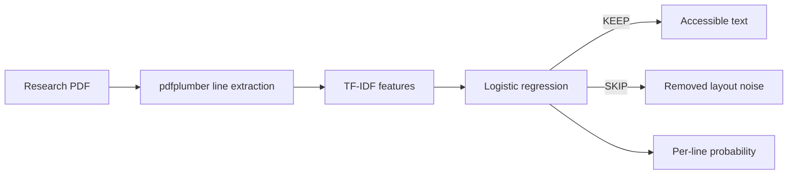

# Architecture

CleanListen is deliberately small. The notebook remains useful for research, while the package provides a reproducible product path.

## Components

### `pdf.py`
Extracts non-empty text lines from text-based PDFs. OCR is intentionally outside the current scope so extraction and classification remain separate concerns.

### `schema.py`
Normalizes the small training-data contract. Common column names such as `text`/`line` and `label`/`decision` are auto-detected, while callers can override them explicitly.

### `model.py`
Owns the classifier, model artifact format, training, and line-level predictions. Model artifacts store metadata alongside the scikit-learn pipeline while remaining backward-compatible with older plain-pipeline artifacts.

### `evaluation.py`
Runs a held-out benchmark. If a document/group column exists, the split keeps entire papers on one side of the train/test boundary. This is a stronger test than randomly splitting individual lines from the same document.

### `cli.py`
Provides three user workflows:

- `train` — create a model artifact from labeled lines
- `clean` — turn a PDF into cleaner text and optional JSON stats
- `benchmark` — generate reproducible held-out metrics

## Design choices

- **Preserve content instead of summarizing it.** The model decides whether a line should be read, not how to rewrite it.
- **Keep the model interpretable.** TF-IDF + logistic regression is fast, inspectable, and appropriate for a small labeled dataset.
- **Make evaluation harder over time.** Document-grouped evaluation is the target once each line can be traced back to its source PDF.
- **Keep OCR separate.** Scanned PDFs are a different extraction problem and should not be silently mixed into classifier quality.
